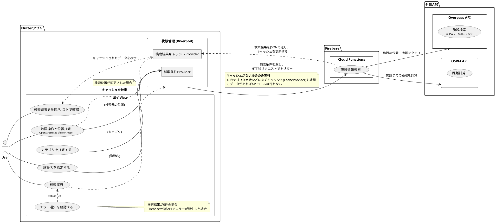

```plantuml
@startuml
left to right direction

actor User

' === フロントエンド (Flutter) ===
package "Flutterアプリ" {
    rectangle "UI / View" {
        usecase "地図操作と位置指定\n<size:10>OpenStreetMap (flutter_map)</size>" as MapInteraction
        User -- MapInteraction

        User -- (カテゴリを指定する)
        User -- (施設名を指定する)
        User -- (検索実行)
        User -- (検索結果を地図/リストで確認)
        (エラー通知を確認する) .> (検索実行) : <<extend>>
        note right of (エラー通知を確認する)
         - 検索結果が0件の場合
         - Firebase/外部APIでエラーが発生した場合
        end note
    }

    rectangle "状態管理 (Riverpod)" as Riverpod {
        rectangle "検索条件Provider" as ConditionProvider
        rectangle "検索結果キャッシュProvider" as CacheProvider
    }
    MapInteraction -> ConditionProvider : (検索元の位置)
    (カテゴリを指定する) -> ConditionProvider : (カテゴリ)
    (施設名を指定する) -> ConditionProvider : (施設名)

    MapInteraction ..> CacheProvider : <b>キャッシュを破棄</b>
    note top on link: 検索位置が変更された場合

    (検索実行) ..> Riverpod

    (検索結果を地図/リストで確認) <.. CacheProvider : キャッシュされたデータを表示
}


' === バックエンド (Firebase) ===
package "Firebase" {
    rectangle "Cloud Functions" as Functions {
        (施設情報検索)
    }
}

' === 外部API ===
package "外部API" {
    rectangle "Overpass API" as Overpass {
        (施設検索\n<size:10>カテゴリ・位置フィルタ</size>)
    }
    rectangle "OSRM API" as OSRM {
       (距離計算)
    }
}


' === データフロー ===
Riverpod --> (施設情報検索) : 検索条件を渡し、\nHTTPSリクエストでトリガー
note on link
  <b>キャッシュがない場合のみ実行</b>
  1. カテゴリ指定時などにまずキャッシュ(CacheProvider)を確認
  2. データがあればAPIコールは行わない
end note


(施設情報検索) --> Overpass : 施設の位置・情報をクエリ
(施設情報検索) --> OSRM : 施設までの距離を計算

(施設情報検索) ..> CacheProvider : 検索結果をJSONで返し、\nキャッシュを更新する

@enduml
```
