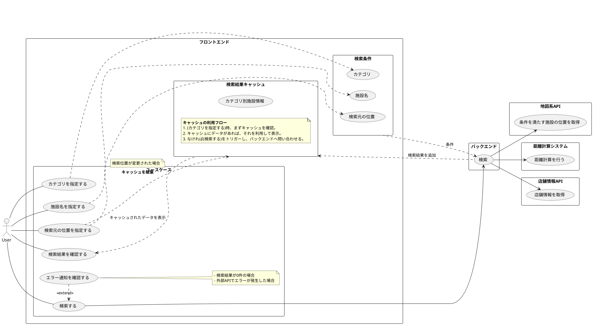

```plantuml
@startuml
left to right direction

actor User

' === フロントエンド（操作とデータ定義） ===
rectangle "フロントエンド" {
    rectangle "ユースケース" {
        User -- (検索元の位置を指定する)
        User -- (カテゴリを指定する)
        User -- (検索する)
        User -- (検索結果を確認する)
        User -- (施設名を指定する)


        (エラー通知を確認する) .> (検索する) : <<extend>>
        note right of (エラー通知を確認する) {
          - 検索結果が0件の場合
          - 外部APIでエラーが発生した場合
        }
    }

    rectangle "検索結果キャッシュ" as Cache {
        (カテゴリ別施設情報)
         note as CacheNote
        <b>キャッシュの利用フロー</b>
        1. (カテゴリを指定する)時、まずキャッシュを確認。
        2. キャッシュにデータがあれば、それを利用して表示。
        3. なければ(検索する)をトリガーし、バックエンドへ問い合わせる。
    end note
    }

    rectangle "検索条件" {
        (検索元の位置を指定する) -.-> (検索元の位置)
        (検索元の位置を指定する) ..> Cache : <b>キャッシュを破棄</b>
        note top on link: 検索位置が変更された場合

        (カテゴリを指定する) -.-> (カテゴリ)
        (施設名を指定する) -.-> (施設名)
    }

}

' === バックエンド ===
rectangle "バックエンド"{
    (検索する) --> (検索)
    (検索条件) -.-> (検索):条件
}

' === 外部API群 ===
rectangle "地図系API" {
    (検索) --> (条件を満たす施設の位置を取得)
}
rectangle "距離計算システム" {
    (検索) --> (距離計算を行う)
}
rectangle "店舗情報API" {
    (検索) --> (店舗情報を取得)
}

' === データフローの戻り ===
rectangle "フロントエンド" {
    Cache <-.. (検索) : 検索結果を追加
    (検索結果を確認する) <.. Cache : キャッシュされたデータを表示
}
@enduml
```
